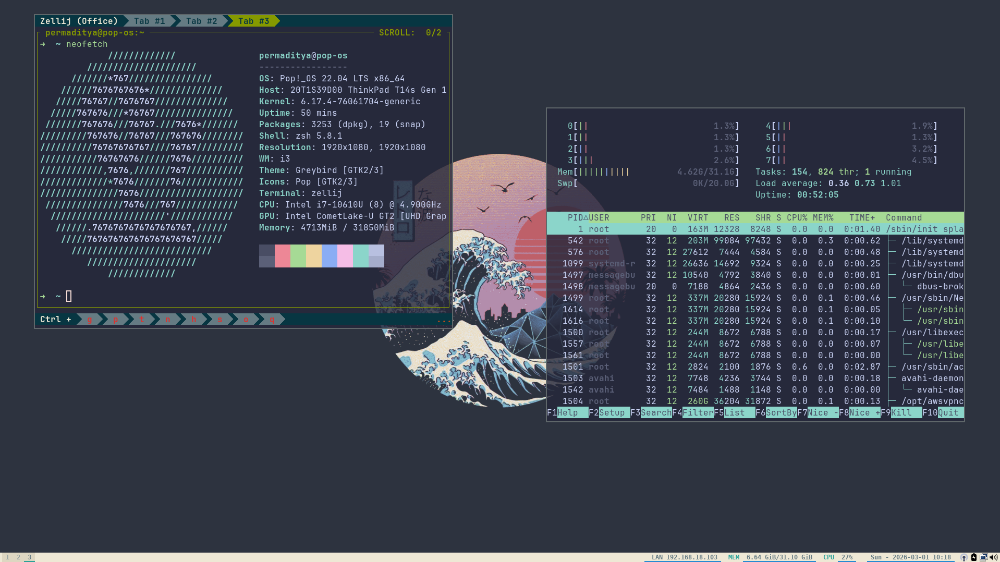

# dotfiles

Personal dotfiles managed with [chezmoi](https://chezmoi.io).



---

## Install

```bash
sh -c "$(curl -fsLS get.chezmoi.io)" -- init --apply adtyap26
```

---

## System

| Tool            | In Use                    |
| --------------- | ------------------------- |
| **OS**          | Pop!\_OS 22.04 LTS x86_64 |
| **WM**          | i3 / dwm                  |
| **Shell**       | zsh + oh-my-zsh           |
| **Terminal**    | Ghostty / Alacritty       |
| **Multiplexer** | Tmux                      |
| **Editor**      | Vim / Zed                 |
| **Bar**         | Polybar                   |
| **Font**        | JetBrainsMono Nerd Font   |
| **Compositor**  | Picom / Compton           |

---

## Structure

```
~/
├── .bashrc
├── .zshrc
├── .zshenv
├── .tmux.conf
├── .vimrc
└── .config/
    ├── alacritty/          # Terminal emulator + 200+ themes
    ├── autorandr/          # Monitor profiles (home-samsung)
    ├── btop/               # System resource monitor
    ├── compton/            # Compositor config
    ├── dunst/              # Notification daemon
    ├── dwm/                # Suckless DWM + patches
    ├── flameshot/          # Screenshot tool
    ├── ghostty/            # Ghostty terminal
    ├── i3/                 # i3wm + i3status
    ├── polybar/            # Status bar + calendar scripts
    └── zed/                # Editor settings + keymap
```

---

## DWM Patches

| Patch     | Description                     |
| --------- | ------------------------------- |
| alpha     | Window transparency             |
| gaps      | Inner/outer gaps                |
| movestack | Move windows in stack           |
| pertag    | Per-tag layout settings         |
| swallow   | Terminal swallows child windows |

---
